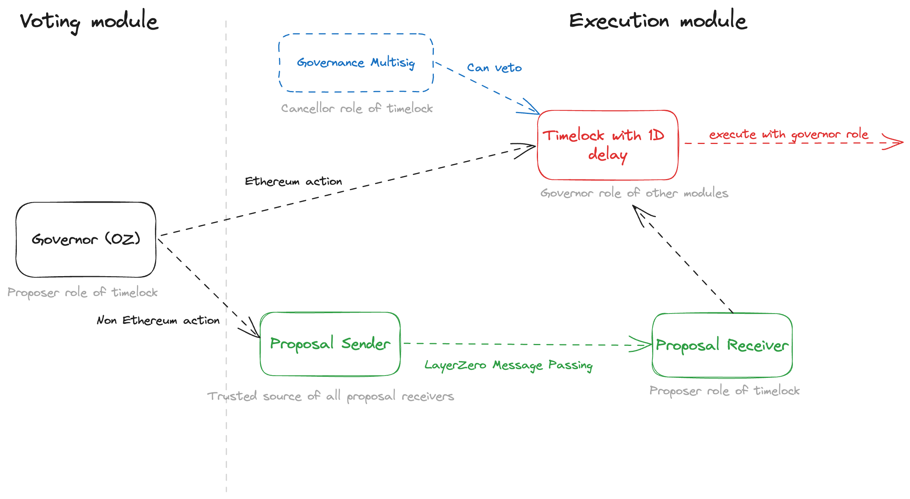

#  Angle Governance

[](https://github.com/AngleProtocol/angle-governance/actions)

## About this repository 🤔

Angle is a decentralized stablecoin protocol, ruled by the [veANGLE token](https://etherscan.io/address/0x0c462dbb9ec8cd1630f1728b2cfd2769d09f0dd5) and natively deployed on multiple EVM compatible chains (including Ethereum, Polygon, Optimism, Arbitrum, ...).

This repository contains the smart contracts for the cross-chain governance system for Angle Protocol relying on LayerZero message passing infrastructure.

It also comes with some utils and scripts to facilitate the creation and execution of proposals on top of the deployed system.

## System Architecture 🏘️

Angle onchain governance works as follows:

- veANGLE holders vote on Ethereum on a [`GovernorBravo`](contracts/AngleGovernor.sol) implementation called `AngleGovernor` with a predetermined quorum, voting delay and proposal threshold.
- On every chain where the protocol is deployed, there is a `Timelock` contract which is admin of all the protocol contracts (Borrowing module, Transmuter, direct deposit modules, ...) of its chain.
- While only onchain votes can lead to payloads being included in the `Timelock` contract of a chain before execution, [Angle 4/6 Governance multisig](https://docs.angle.money/protocol-governance/angle-dao) (deployed on all chains as well) has a veto power on the payloads in Timelock contracts, and can cancel rogue governance votes.
- For successful votes on non-Ethereum proposals, payloads to execute are bridged to the chain of interest using LayerZero message passing technology before being sent to the `Timelock` contract of their chain.



Precisely speaking, once a vote succeeds (majority of positive votes + quorum), the flow is the following:

- If the vote concerns an Ethereum action:
  - The payload to execute is sent to the Ethereum `Timelock` contract. The Ethereum Timelock contract only accepts payload from the `AngleGovernor` contract
  - After the timelock period ends, if the payload is not veto-ed by [Angle Governance multisig](https://etherscan.io/address/0xdC4e6DFe07EFCa50a197DF15D9200883eF4Eb1c8) on Ethereum, it can be executed on Ethereum.
- If the vote concerns an action on another chain:
  - The payload to execute is sent to a [`ProposalSender`](contracts/ProposalSender.sol) contract on Ethereum which is a simple LayerZero message passing contract owned by the `AngleGovernor` contract.
  - This payload is to be received on the destination chain by a [`ProposalReceiver`](contracts/ProposalReceiver.sol) contract which role is to then send the payload to the Timelock contract of this chain. `Timelock` contracts of non-Ethereum chains only accept payloads from their respective `ProposalReceiver` contract.

---

## Documentation 📚

- [Angle Governance Documentation](https://docs.angle.money/protocol-governance/angle-dao)
- [Angle Documentation](https://docs.angle.money)
- [Angle Developers Documentation](https://developers.angle.money)

---

## Bug Bounty ⛑️

For contracts deployed for the Angle Protocol, a bug bounty is open on [Immunefi](https://immunefi.com) and [Hats Finance](https://hats.finance). The rewards and scope of the Angle Immunefi are defined [here](https://immunefi.com/bounty/angleprotocol/).

---

## Deployment Addresses 🚦

All Angle governance deployment addresses can be found in the developers documentation [here](https://developers.angle.money/overview/smart-contracts).

---

## Development 🛠️

This repository is built on [Foundry](https://github.com/foundry-rs/foundry).

### Getting started

#### Install Foundry

If you don't have Foundry:

```bash
curl -L https://foundry.paradigm.xyz | bash

source /root/.zshrc
# or, if you're under bash: source /root/.bashrc

foundryup
```

To install the standard library:

```bash
forge install foundry-rs/forge-std
```

To update libraries:

```bash
forge update
```

#### Install packages

You can install all dependencies by running

```bash
yarn
forge i
```

#### Create `.env` file

In order to interact with non local networks, you must create an `.env` that has:

- a `MNEMONIC` for each of the chain you
- a network key
- an `ETHERSCAN_API_KEY`

For additional keys, you can check the [`.env.example`](/.env.example) file.

#### Warnings

- Always keep your confidential information safe
- This repository uses [`ffi`](https://book.getfoundry.sh/cheatcodes/ffi) in its test suite. Beware as a malicious actor forking this repo may execute malicious commands on your machine

---

### Compilation

Compilation of production contracts is done using the via-ir pipeline.

However, tests do not compile with via-ir, and to run coverage the optimizer needs to be off. Therefore for development and test purposes you can compile without optimizer.

```bash
yarn compile # without compiling tests files
yarn compile:dev # with test files compiling
```

### Testing

Here are examples of how to run the test suite:

```bash
yarn test
FOUNDRY_PROFILE=dev forge test -vvv --watch # To watch changing files
FOUNDRY_PROFILE=dev forge test -vvv --match-path test/Test.t.sol
FOUNDRY_PROFILE=dev forge test -vvv --match-test "testAbc*"
FOUNDRY_PROFILE=dev forge test -vvv --fork-url <RPC_URL>
```

You can also list tests:

```bash
FOUNDRY_PROFILE=dev forge test --list
FOUNDRY_PROFILE=dev forge test --list --json --match-test "testXXX*"
```

---

### Coverage

We recommend the use of this [vscode extension](ryanluker.vscode-coverage-gutters).

```bash
yarn coverage
```

You'll need to install lcov `brew install lcov` to visualize the coverage report.

---

### Gas report ⛽️

```bash
yarn gas
```

---

## Contributing

If you're interested in contributing, please see our [contributions guidelines](./CONTRIBUTING.md).

---

## Questions & Feedback

For any question or feedback you can send an email to [contact@angle.money](mailto:contact@angle.money). Don't hesitate to reach out on [Twitter](https://twitter.com/AngleProtocol)🐦 as well.

---

## License

This repository is released under the [MIT License](LICENSE).
